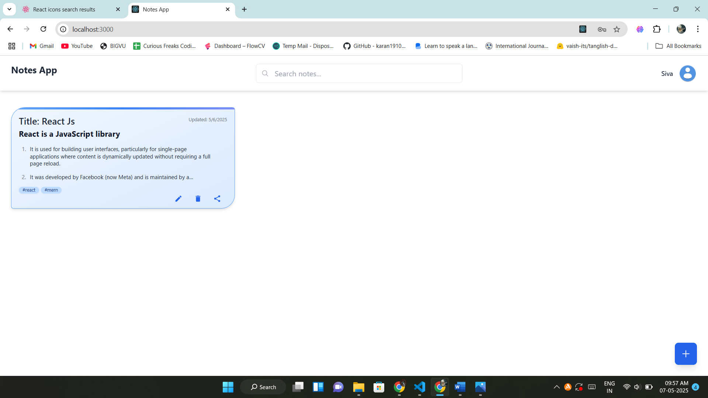
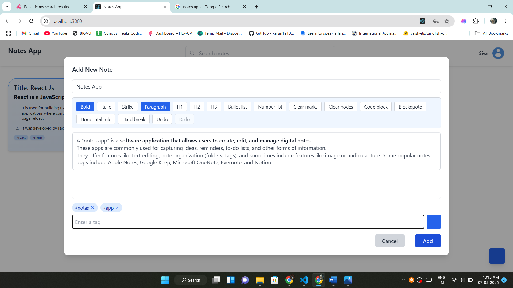
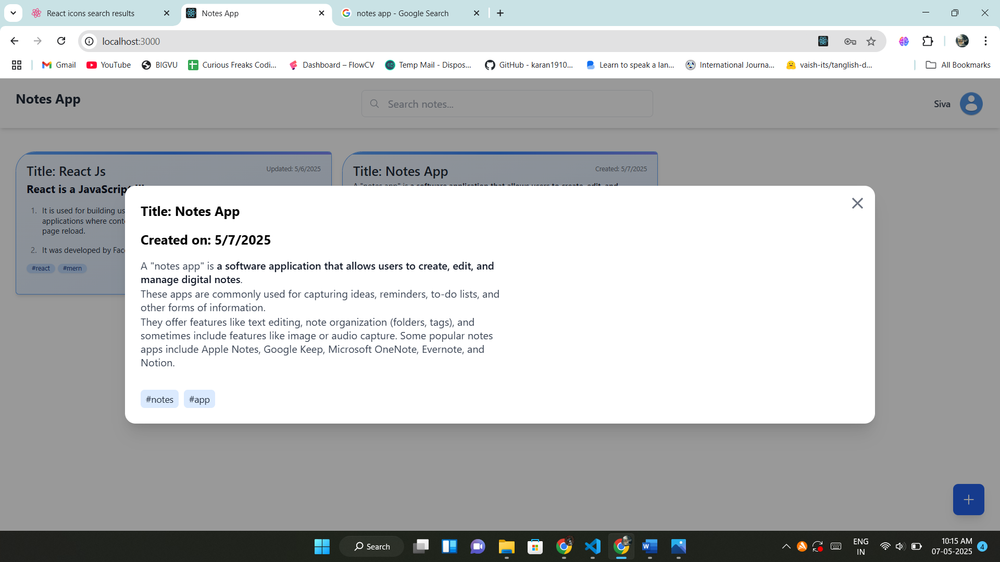
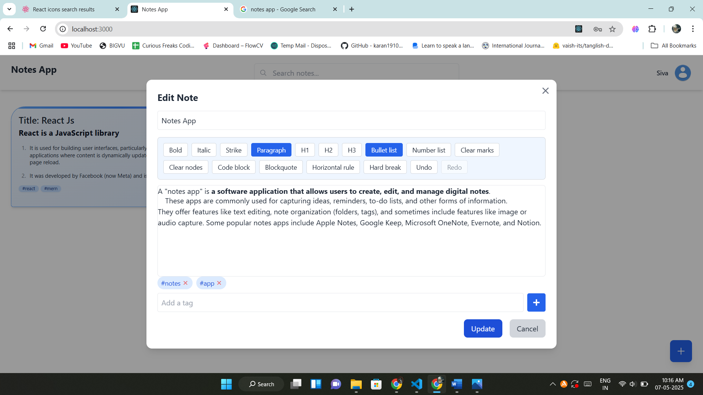
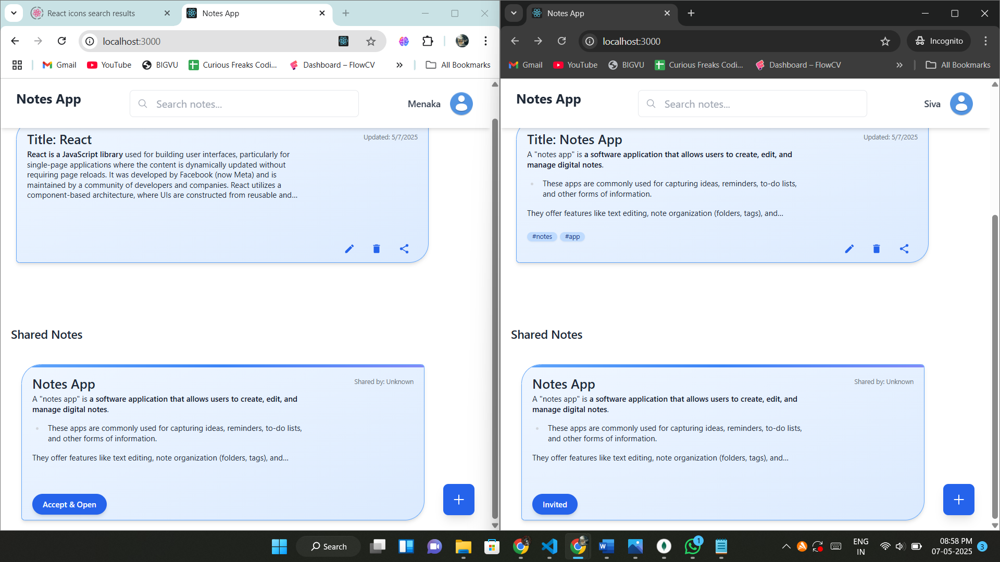

# 📝 Collaborative Notes App (React)

A powerful and modern **Collaborative Notes Application** built with React. This app allows users to **create**, **edit**, **view**, **delete**, and **share** notes in real time. It features a **rich text editor**, **permission-based sharing**, and real-time synchronization for seamless collaboration.

---

## 🚀 Features

- 📝 Rich Text Editor using `@tiptap/starter-kit`
- 🔄 Real-Time Sync for collaborative editing
- 👥 Share notes with others (read/edit permissions)
- 🗂️ View, search, and organize your notes
- 📱 Responsive design for desktop and mobile
- ✅ Authenticated user actions (optional integration)
- 🔒 Private & public notes management

---

## 📷 Screenshots

### Dashboard – Notes Overview

### Rich Text Editor

### View Note Modal

### Edit Note Modal

### Sahare Note Modal

---

## 🛠️ Tech Stack

- **Frontend**: React 19.1.0, Tailwind CSS, React Icons
- **Editor**: TipTap (`@tiptap/tiptap-react`)
- **State Management**: React useState/useContext
- **Real-Time (optional)**: Socket.io / Firebase / Supabase
- **Backend** (optional): Node.js, Express.js, MongoDB

---

